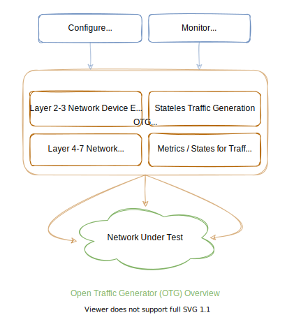

<h1 align="center">
  
  Open Traffic Generator
</h1>

Open Traffic Generator (**OTG**) is an open standard, specifying declarative and vendor neutral API for testing Layer 2-7 network devices and topologies (at any scale).

    

### Quick Tour

- The [specification](https://github.com/open-traffic-generator/models) is written using [OpenApi](https://spec.openapis.org/oas/latest.html) (and custom extensions), with self-updating [online documentation](https://redocly.github.io/redoc/?url=https://raw.githubusercontent.com/open-traffic-generator/models/master/artifacts/openapi.yaml&nocors)
- The SDK is available for Python ([snappi](https://github.com/open-traffic-generator/snappi)) and Go ([gosnappi](https://github.com/open-traffic-generator/snappi/tree/main/gosnappi)),
    * Supports both `HTTPs/JSON` and `gRPC/protobuf` as transport
    * Intended to be used by both client and server
    * Auto-generated using [openapiart](https://github.com/open-traffic-generator/openapiart)
- The [yang specification](https://github.com/open-traffic-generator/models-yang) is also maintained to support gNMI (only for OTG telemetry)
- [Keysight](https://www.keysight.com/in/en/products/network-test/protocol-load-test/keysight-elastic-network-generator.html) provides a reference implementation called [Ixia-C](https://github.com/open-traffic-generator/ixia-c)
- [OTG Conformance Tests](https://github.com/open-traffic-generator/conformance) hosts OTG tests for variety of use-cases